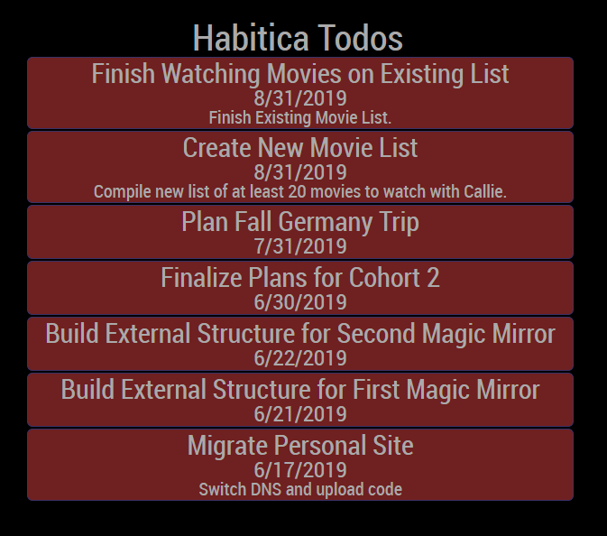

# Magic Mirror Module for Habitica Todo Tracking

This module allows you to keep track of all of your to-dos in the task tracker Habitica. It shows any to-dos you might have listed either by `date` or `value` and in the order of your choice. All that is required is your API key and your user id. Both can be obtained either through the mobile app or by logging into the Habitica website and going [here](https://habitica.com/user/settings/api). 

# Configuration
Once you obtain your `API Key` and `UserId`, configuration for the module takes the following pattern in your mirror's `config.js` file:

``` javascript
{
    apiKey: 'YOUR API KEY', //Required
    userID: 'YOUR USER ID', //Required
    sortKey: 'SORT BY', // Optional.
    order: 'SORT ORDER', // Optional.
    showNotes: 'WHETHER OR NOT TO SHOW NOTES', // Optional.
    showDueDate: 'WHETHER OR NOT TO SHOW DUE DATE' // Optional.
}
```
### Optional Values
* `sortKey` - This is what value you would like to sort the to-dos by. Valid options are `'date'` (due date) or `'value'` (value assigned to the task by the habitica app). Default value is `'date'` if no value is provided.
* `order` - What order to display the sorted to-dos. Valid options are `'ASC'` (Sorts values in ascending order) or `'DESC'` (sorts values in descending order). Default value is `'ASC'` if no value is provided.
* `showNotes` - Whether or not to display any notes you have added to the to-do. Valid options are `true` or `false`. Default value is false if no value is provided.
* `showDueDate` - Whether or not to display the due date you have assigned to the to-do. Valid options are `true` or `false`. Default value is `true` if no value is provided.

# Appearance 

Once you have set up your module correctly it will display all of your to-dos. They will appear with the same color as they do in the application or on mobile. This color will be slightly faded to allow for less of a distraction in the magic mirror itself. Below is an example which displays some of my to-dos at the time of building this module. 

### Example:

